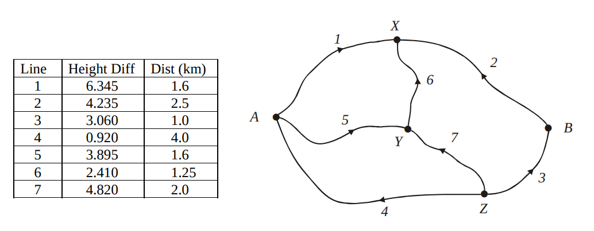
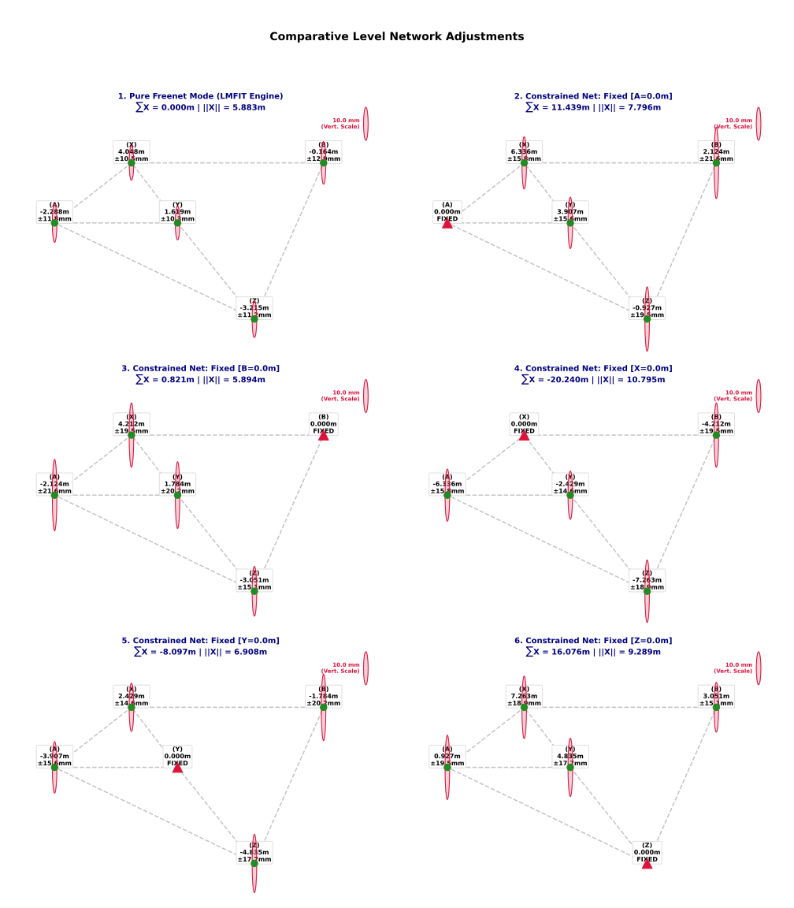

### GEODETIC FREE NETWORK ADJUSTMENT:  
An example of FREE LEVEL NET ADJUSTMENT, Dr. Rod Deakin , RMIT, Australia  
Reanalyzed by Dr.-Ing Phisan Santitamnont,  Chulalongkorn University, Thailand  

### Theoretical Properties of Free Network Adjustment

The **Free Network Adjustment** (or Minimum Norm Least Squares) method uniquely solves the rank-deficient system by imposing a minimum-norm condition on the parameter corrections. This optimization satisfies three distinct mathematical criteria:

#### 1. Minimum Parameter Corrections ($L_2\text{-Norm}$)
The solution minimizes the sum of squares of the estimated coordinate changes. The objective function minimizes the $L_2\text{-norm}$:

$$\min \|\hat{X}\|_2^2 = \min \left( \hat{X}^T \hat{X} \right) = \min \sum_{i=1}^{u} \hat{x}_i^2$$

Where:
*   $\hat{X}$ is the vector of coordinate corrections.
*   $u$ is the number of parameters.

#### 2. Sum of the Coordinate Changes
Under the inner constraints ($B^T \hat{X} = 0$), the algebraic sum of the corrections for each datum transformation component equals zero:

$$\sum \hat{X} = 0$$

#### 3. Minimum Trace of the Datum Cofactor Matrix
The configuration of the datum minimizes the overall variance of the network parameters. The trace of the estimated parameter cofactor matrix $Q_{xx}$ achieves its theoretical minimum:

$$\min \text{Tr}(Q_{xx}) = \min \sum_{i=1}^{u} q_{x_i x_i}$$

Where:
*   $Q_{xx}$ is the pseudo-inverse of the normal equations matrix ($N^+$).
*   $q_{x_i x_i}$ represents the variance factors of the adjusted coordinates.

### Example of a Levelling Network

  

### Implementation Details

This software implementation relies on the following core components:
*   **`lmfit`**: An advanced Python package utilized for robust least-squares adjustments.
*   **`numpy`**: Employed for matrix computations, specifically leveraging the **Moore-Penrose pseudo-inverse** ($N^+$) to solve the rank-deficient system of equations.

The original mathematical core closely follows the linear algebra framework established by **Dr. Deakin** for solving network adjustments subject to **inner constraints,** $$\phi = v^T W v - 2k^T (Cx - g) \Rightarrow \text{minimum}$$
 as thoroughly demonstrated in his article , see Reference

| Points | Network Type | Sum(X) (m) | L2-Norm (m) | Trace(Qxx) |
| :---:  | :---        | :---:      | :---:       | :---:      |
| 5 | FreeNet lmfit              |      0.000 |       5.883 | 2337.50649 |
| 5 | FreeNet pseudo-inverse  |      0.000 |       5.883 | 2337.50649 |
| 4 | 'A'                       |     11.439 |       7.796 | 4834.65067 |
| 4 | 'B'                       |      0.821 |       5.894 | 5354.87221 |
| 4 | 'X'                       |    -20.240 |      10.795 | 4335.71799 |
| 4 | 'Y'                       |     -8.097 |       6.908 | 4243.40853 |
| 4 | 'Z'                       |     16.076 |       9.289 | 4606.41551 |

### Key Insights from the Comparison Table
*   **Identical Implementation**: `FreeNet lmfit` and `FreeNet pseudo-inverse` yield identical metrics, proving that the `lmfit` implementation perfectly replicates the Moore-Penrose pseudo-inverse mathematical method.
*   **Zero Centroid Shift**: The Free Network methods maintain a `Sum(X)` of exactly **$0.000\text{ m}$**, confirming that inner constraints successfully preserve the geometric centroid of the network.
*   **Minimum Coordinate Distortion**: Free Network methods achieve the lowest geometric shift (**$L_2\text{-Norm} = 5.883\text{ m}$**), while fixing single datum points (e.g., point 'X') forces significantly larger coordinate distortions (up to $10.795\text{ m}$).
*   **Maximum Network Precision**: Free Network methods yield the lowest global variance (**$\text{Trace}(Q_{xx}) = 2337.51$**), mathematically proving they deliver the highest possible precision across the adjusted points compared to any single-point fixation.

  

## References
*   Deakin, R. E. *Free Net Level Adjustment: Notes on the application of inner constraints to overcome datum deficiency problems in level network adjustments.* [myGeodesy](http://www.mygeodesy.id.au/).
