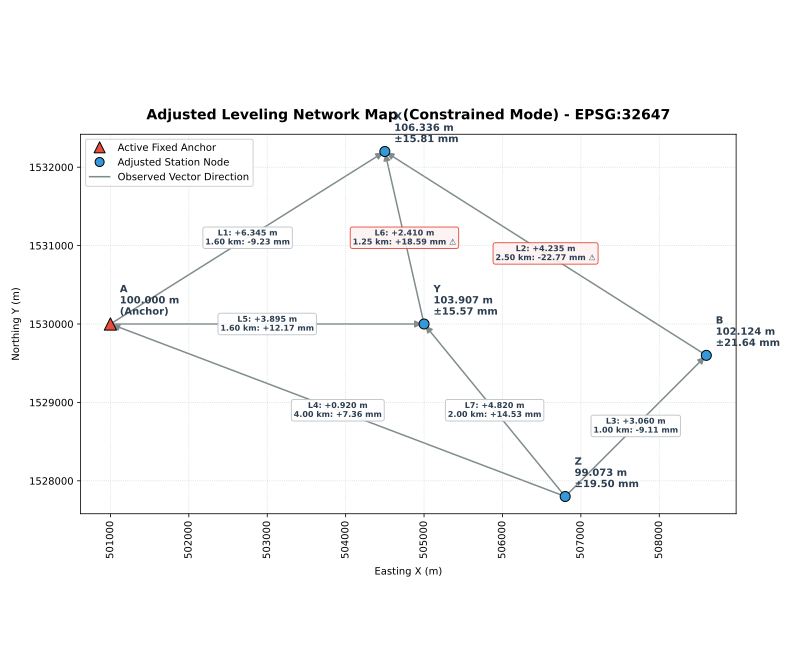
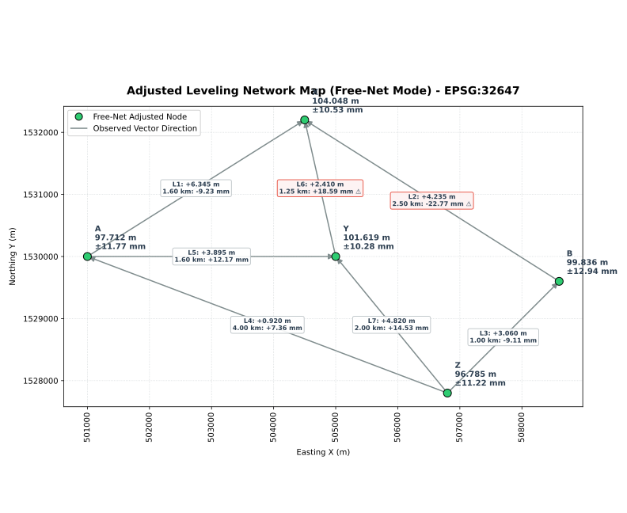

  
  

[System] Ingesting source architecture layout: DEAKIN/Deakin_Free.toml
### NETWORK INTEGRITY & DATUM AUDIT

#### Fixed Benchmarks (`dfFixed`)
| Station   |   Height_m | Effective        |
|:----------|-----------:|:-----------------|
| A         |        100 | **Yes (Active)** | 

#### Station Positions (`dfPos`)
| Station   |      X |       Y |
|:----------|-------:|--------:|
| A         | 501000 | 1530000 |
| Y         | 505000 | 1530000 |
| X         | 504500 | 1532200 |
| Z         | 506800 | 1527800 |
| B         | 508600 | 1529600 |
| C         | 502000 | 1531000 | 

#### Differential Leveling Lines (`dfDiff`)
> `*` indicates an Effective Fixed Anchor Base Node

|   LineNo | StaFrom   | StaTo   |   Diff_m |   Dist_km |
|---------:|:----------|:--------|---------:|----------:|
|        1 | **A***    | X       |    6.345 |      1.6  |
|        2 | B         | X       |    4.235 |      2.5  |
|        3 | Z         | B       |    3.06  |      1    |
|        4 | Z         | **A***  |    0.92  |      4    |
|        5 | **A***    | Y       |    3.895 |      1.6  |
|        6 | Y         | X       |    2.41  |      1.25 |
|        7 | Z         | Y       |    4.82  |      2    |

[System] Initializing Least Squares Engine optimization routines...

==================================================
    LMFIT ENGINE REPORT (CONSTRAINED ADJUSTMENT)    
==================================================
[[Fit Statistics]]
    # fitting method   = leastsq
    # function evals   = 11
    # data points      = 7
    # variables        = 4
    chi-square         = 8.3188e-04
    reduced chi-square = 2.7729e-04
    Akaike info crit   = -55.2640977
    Bayesian info crit = -55.4804571
[[Variables]]
    Y:  103.907174 +/- 0.01556518 (0.01%) (init = 100)
    Z:  99.0726412 +/- 0.01950144 (0.02%) (init = 100)
    A:  100 (fixed)
    X:  106.335769 +/- 0.01580993 (0.01%) (init = 100)
    B:  102.123535 +/- 0.02163533 (0.02%) (init = 100)
[[Correlations]] (unreported correlations are < 0.100)
    C(Z, B) = +0.7361
    C(Y, X) = +0.5659
    C(Y, Z) = +0.5119
    C(X, B) = +0.4932
    C(Y, B) = +0.4477
    C(Z, X) = +0.4417
None

#### ADJUSTED GEODETIC ELEVATIONS
| Station   |   Adjusted_Height_m | StdDev_mm      |
|:----------|--------------------:|:---------------|
| A         |            100      | FIXED (Anchor) |
| B         |            102.124  | 21.64          |
| X         |            106.336  | 15.81          |
| Y         |            103.907  | 15.57          |
| Z         |             99.0726 | 19.50          |

==================================================

#### OBSERVATION ADJUSTMENT & TOLERANCE AUDIT
> Tolerance Rule: abs(Residual_mm) > 12.0 * √(Dist_km)
|   LineNo | StaFrom   | StaTo   |   Diff_m |   Dist_km | Residual_mm    | Allowable_Tol_mm   | Remark     |
|---------:|:----------|:--------|---------:|----------:|:---------------|:-------------------|:-----------|
|        1 | A         | X       |    6.345 |      1.6  | -9.23          | ±15.18             |            |
|        2 | B         | X       |    4.235 |      2.5  | **-22.77 !!!** | ±18.97             | ⚠️ Outlier |
|        3 | Z         | B       |    3.06  |      1    | -9.11          | ±12.00             |            |
|        4 | Z         | A       |    0.92  |      4    | +7.36          | ±24.00             |            |
|        5 | A         | Y       |    3.895 |      1.6  | +12.17         | ±15.18             |            |
|        6 | Y         | X       |    2.41  |      1.25 | **+18.59 !!!** | ±13.42             | ⚠️ Outlier |
|        7 | Z         | Y       |    4.82  |      2    | +14.53         | ±16.97             |            |

==================================================

#### EXPORTED DATA STATIONS LOG SUMMARY
> Successfully transformed results file written to: adjusted_stations.csv

| Station   |   Adjusted_Height_m |   StdDev_mm | type     |
|:----------|--------------------:|------------:|:---------|
| A         |            100      |        0    | FIXED    |
| B         |            102.124  |       21.64 | ADJUSTED |
| X         |            106.336  |       15.81 | ADJUSTED |
| Y         |            103.907  |       15.57 | ADJUSTED |
| Z         |             99.0726 |       19.5  | ADJUSTED |

==================================================

[System] Ingesting source architecture layout: DEAKIN/Deakin_Free.toml
### NETWORK INTEGRITY & DATUM AUDIT

#### Fixed Benchmarks (`dfFixed`)
| Station   | Height_m   | Effective   |
|-----------|------------|-------------| 

#### Station Positions (`dfPos`)
| Station   |      X |       Y |
|:----------|-------:|--------:|
| A         | 501000 | 1530000 |
| Y         | 505000 | 1530000 |
| X         | 504500 | 1532200 |
| Z         | 506800 | 1527800 |
| B         | 508600 | 1529600 |
| C         | 502000 | 1531000 | 

#### Differential Leveling Lines (`dfDiff`)
> `*` indicates an Effective Fixed Anchor Base Node

|   LineNo | StaFrom   | StaTo   |   Diff_m |   Dist_km |
|---------:|:----------|:--------|---------:|----------:|
|        1 | A         | X       |    6.345 |      1.6  |
|        2 | B         | X       |    4.235 |      2.5  |
|        3 | Z         | B       |    3.06  |      1    |
|        4 | Z         | A       |    0.92  |      4    |
|        5 | A         | Y       |    3.895 |      1.6  |
|        6 | Y         | X       |    2.41  |      1.25 |
|        7 | Z         | Y       |    4.82  |      2    |

[System] Initializing Least Squares Engine optimization routines...

==================================================
    LMFIT ENGINE REPORT (FREE NETWORK ADJUSTMENT)    
==================================================
[[Fit Statistics]]
    # fitting method   = leastsq
    # function evals   = 13
    # data points      = 8
    # variables        = 5
    chi-square         = 8.3188e-04
    reduced chi-square = 2.7729e-04
    Akaike info crit   = -63.3700771
    Bayesian info crit = -62.9728694
[[Variables]]
    A:  97.7121761 +/- 0.01176813 (0.01%) (init = 100)
    X:  104.047945 +/- 0.01052704 (0.01%) (init = 100)
    B:  99.8357110 +/- 0.01293599 (0.01%) (init = 100)
    Y:  101.619351 +/- 0.01028101 (0.01%) (init = 100)
    Z:  96.7848173 +/- 0.01121745 (0.01%) (init = 100)
[[Correlations]] (unreported correlations are < 0.100)
    C(A, B) = -0.5329
    C(X, Z) = -0.5134
    C(B, Y) = -0.5105
    C(A, Z) = -0.4393
    C(X, B) = -0.3764
    C(Y, Z) = -0.3482
    C(B, Z) = +0.2270
None

#### ADJUSTED GEODETIC ELEVATIONS
| Station   |   Adjusted_Height_m | StdDev_mm        |
|:----------|--------------------:|:-----------------|
| A         |             97.7122 | 11.77 (Free-Net) |
| B         |             99.8357 | 12.94 (Free-Net) |
| X         |            104.048  | 10.53 (Free-Net) |
| Y         |            101.619  | 10.28 (Free-Net) |
| Z         |             96.7848 | 11.22 (Free-Net) |

==================================================

#### OBSERVATION ADJUSTMENT & TOLERANCE AUDIT
> Tolerance Rule: abs(Residual_mm) > 12.0 * √(Dist_km)
|   LineNo | StaFrom   | StaTo   |   Diff_m |   Dist_km | Residual_mm    | Allowable_Tol_mm   | Remark     |
|---------:|:----------|:--------|---------:|----------:|:---------------|:-------------------|:-----------|
|        1 | A         | X       |    6.345 |      1.6  | -9.23          | ±15.18             |            |
|        2 | B         | X       |    4.235 |      2.5  | **-22.77 !!!** | ±18.97             | ⚠️ Outlier |
|        3 | Z         | B       |    3.06  |      1    | -9.11          | ±12.00             |            |
|        4 | Z         | A       |    0.92  |      4    | +7.36          | ±24.00             |            |
|        5 | A         | Y       |    3.895 |      1.6  | +12.17         | ±15.18             |            |
|        6 | Y         | X       |    2.41  |      1.25 | **+18.59 !!!** | ±13.42             | ⚠️ Outlier |
|        7 | Z         | Y       |    4.82  |      2    | +14.53         | ±16.97             |            |

==================================================

#### EXPORTED DATA STATIONS LOG SUMMARY
> Successfully transformed results file written to: adjusted_stations.csv

| Station   |   Adjusted_Height_m |   StdDev_mm | type    |
|:----------|--------------------:|------------:|:--------|
| A         |             97.7122 |       11.77 | FREENET |
| B         |             99.8357 |       12.94 | FREENET |
| X         |            104.048  |       10.53 | FREENET |
| Y         |            101.619  |       10.28 | FREENET |
| Z         |             96.7848 |       11.22 | FREENET |

==================================================

